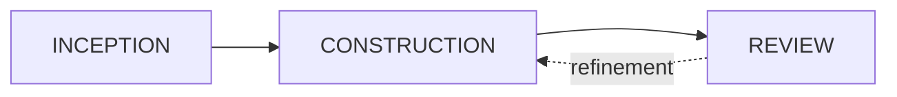

# Vision

Software development is increasingly a collaboration between humans and AI agents. But most tools treat agents as isolated code generators that receive a prompt and return code. They miss the bigger picture: how do you go from a business idea to production software when AI is involved? How do you keep traceability between what was intended and what was built? How do you prevent agents from losing context as scope grows?

AIDLC Collaborative answers these questions with an opinionated workflow built on three principles:

**Structured data as the backbone.** Requirements, user stories, tasks, and code live in a graph database. The link between what was intended and what was implemented is never lost. When a requirement changes, you can trace exactly what downstream work is affected.

**Context by design.** By connecting every artifact explicitly, agents work with the context they need rather than searching for it. This keeps token usage bounded and avoids agents exploring entire codebases to understand what they should build.

**Human judgment at natural breakpoints.** The workflow has clear phases where humans approve, redirect, or refine. This keeps humans in the loop without making them a bottleneck on every action.

## The lifecycle

The platform implements a three-phase lifecycle organized around **sprints**:

Each phase has a clear purpose:

| Phase | Purpose | Output |
|-------|---------|--------|
| **Inception** | Define what to build | Requirements, user stories, and tasks |
| **Construction** | Build it | Code changes in a branch |
| **Review** | Evaluate the result | Approval or feedback for another iteration |

A sprint moves through these phases sequentially. The Review phase can send work back to Construction with structured feedback, creating an iterative improvement loop until the result meets expectations.

## Sprints

A sprint is the unit of work in AIDLC Collaborative. It groups a set of requirements, user stories, and tasks under a single lifecycle. Each sprint tracks:

- Its current phase (Inception, Construction, or Review)
- The project description that scopes the work
- Git branch information for code changes
- Agent execution state

You start a sprint by writing a project description, then launch the Inception Agent to break it down into structured artifacts.

## Current status

| Phase | Status |
|-------|--------|
| Inception | Working |
| Construction | Working |
| Review | Working |

Read about each phase in detail:

- [Inception](inception.md)
- [Construction](construction.md)
- [Review](review.md)
