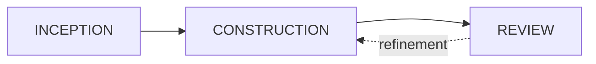

# AIDLC Collaborative

AIDLC Collaborative is an opinionated implementation of the [AI-DLC methodology](https://github.com/awslabs/aidlc-workflows): a platform where humans and AI agents collaborate on software development through a shared, structured workflow.

You define what you want built. AI agents plan, implement, and review it. Everything (requirements, user stories, tasks, code) is connected in a graph so nothing gets lost between intent and implementation.

## Founding principles

This platform is built on a set of principles that survive tool changes and technology shifts. Regardless of which LLM or which IDE becomes dominant, these fundamentals remain:

- **Structured data over raw context.** Instead of relying on massive context windows and attention mechanisms across 200k+ tokens, we use structured databases (graph, NoSQL) to maintain explicit links between requirements, human/agent interactions, code files, and decisions. This gives agents bounded, relevant context rather than forcing them to search entire codebases.
- **Traceability by design.** Every artifact (requirement, user story, task, code change, review comment) is tracked in a graph database. You can trace from a business requirement down to the exact code that implements it, and back. Task status, ownership, and history are always visible.
- **Human observability at every phase.** Humans approve, redirect, or refine at natural breakpoints. The key idea: abstract away the noise of each agent's raw output and surface only the high-level, business-relevant information. This prevents cognitive overload for the human reviewer — their "context window" (brain) is limited too.
- **Real-time collaboration, multi-agent.** Most AI coding tools today are local, individual, and excellent for personal productivity. But they hit a wall in enterprise contexts: data stays local, syncing config files and skills is manual, and there is no shared state. This platform is collaborative-first, with multiple agents and humans working in the same structured workspace simultaneously.
- **Tool-agnostic architecture.** We take what works best for each module. The platform integrates proven, adopted tools (GitHub, Claude Code, OpenCode, Kiro) rather than locking into a single vendor. The important thing is the _concept_ at each layer — structured data, traceability, collaboration, observability — not the specific implementation. See [Concepts](concepts/index.md) for details on technology choices and alternatives.

## The lifecycle

The platform implements a three-phase lifecycle organized around **sprints**:

Each phase has a clear purpose:

| Phase            | Purpose                                | Output                                     |
| ---------------- | -------------------------------------- | ------------------------------------------ |
| **Inception**    | Define what to build, remove ambiguity | Requirements, user stories, and tasks      |
| **Construction** | Build it                               | Code changes in a branch                   |
| **Review**       | Evaluate the result                    | Approval or feedback for another iteration |

A sprint moves through these phases sequentially. The Review phase can send work back to Construction with structured feedback, creating an iterative improvement loop until the result meets expectations.

## How it works

In the **Inception** phase, you describe what you want to build. The Inception Agent breaks your description into structured requirements, user stories, and tasks. It asks clarifying questions when things are ambiguous.

In the **Construction** phase, multiple agents pick up tasks and write code. They work in git branches, track every file modified, and create pull requests when done.

In the **Review** phase, review agents evaluate the code from two angles (blind and full context). Users add their own comments and make the final pass/fail decision. If something needs fixing, a Modify Agent applies targeted changes.

## Key features

- **Real-time collaboration** on specs with multiple users editing simultaneously
- **LLM-assisted planning** through the Inception Agent that generates structured artifacts
- **Autonomous remote agent execution** with parallel task dispatch
- **Structured review** with blind and full review agents plus manual evaluation
- **GitHub integration** for pushing tasks as issues and syncing status
- **Methodology templates** to standardize how specs are written across projects
- **Role-based access control** with organizations, projects, and fine-grained permissions
- **Graph-based traceability** from requirements to code

## Next steps

- [Getting Started](getting-started/prerequisites.md) to set up the platform
- [How it works](concepts/index.md) to understand the lifecycle and principles
- [Using the Platform](using-the-platform/projects.md) for day-to-day usage guides
