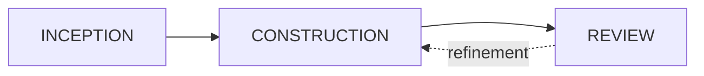

# AIDLC Collaborative

AIDLC Collaborative is an opinionated implementation of the [AI-DLC methodology](https://github.com/awslabs/aidlc-workflows): a platform where humans and AI agents collaborate on software development through a shared, structured workflow.

You define what you want built. AI agents plan, implement, and review it. Everything (requirements, user stories, tasks, code) is connected in a graph so nothing gets lost between intent and implementation.

The platform implements a three-phase lifecycle organized around sprints:

## How it works

In the **Inception** phase, you describe what you want to build. The Inception Agent breaks your description into structured requirements, user stories, and tasks. It asks clarifying questions when things are ambiguous.

In the **Construction** phase, the Construction Agent picks up tasks and writes code. It works in a git branch, tracks every file it modifies, and creates a pull request when done.

In the **Review** phase, review agents evaluate the code from two angles (blind and full context). You add your own comments and make the final pass/fail decision. If something needs fixing, a Modify Agent applies targeted changes.

## Key features

- **Real-time collaboration** on specs with multiple users editing simultaneously
- **LLM-assisted planning** through the Inception Agent that generates structured artifacts
- **Autonomous agent execution** using ECS Fargate containers
- **Structured review** with blind and full review agents plus manual evaluation
- **GitHub integration** for pushing tasks as issues and syncing status
- **Methodology templates** to standardize how specs are written across projects
- **Role-based access control** with organizations, projects, and fine-grained permissions
- **Graph-based traceability** from requirements to code via Neptune

## Next steps

- [Getting Started](getting-started/prerequisites.md) to set up the platform
- [How it works](concepts/index.md) to understand the lifecycle
- [Using the Platform](using-the-platform/organizations-and-projects.md) for day-to-day usage guides
